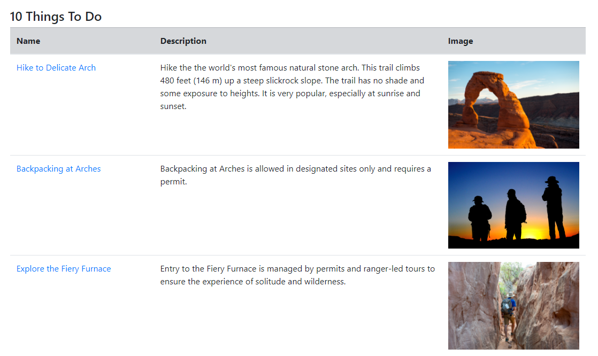

# Planet Park

## Overview

This application was created for an end-of-semester project in DSCI 551: Foundations of Data Management at the University of Southern California (a required class for the Applied Data Science MS program).

Planet Park is a web application meant to enable users to explore and discover the wide variety of US National Parks available for access, as well as to discuss their experiences in an online format with the intent of rekindling people’s connection with nature and bolstering public support for continued preservation of US parks and wildlife. In the digital age, awareness of National Parks and what they represent is constantly diminishing, and this is exacerbated by the fact that the government itself is not particularly effective in engaging with the public on online platforms. This app seeks to bridge the gap between parks and the people by offering an intuitive, easy-to-use, and socially-focused web application that allows users to explore the rich diversity and beauty of nature available across the country. 

## Getting Started

### Dependencies

This project was built using Python 3.10.6, and a number of external libraries:
- Django
- Dash 
- Plotly
- Django-Plotly-Dash (for embedding Dash apps into Django projects)
- Geopy
- Numpy
- Pandas 

Planet Park was built using Django atop a cloud-based Heroku PostgreSQL relational database, and utilizes Plotly-Dash (integrated using the django-plotly-dash package) for the inclusion of additional interactive components, the OpenWeatherMap API for querying of live weather data, the Nominatim OpenStreetMap API for processing of user inputted addresses, and Cloudinary (also served by Heroku) for storage of user-uploaded images on the cloud. The UI was styled using the Bootstrap4 styling framework.

The specific version of each installed package can be found in `requirements.txt`. Any Python environment with these packages will be able to run the code, as long as the versions are the same (the code may work for other Python/package versions, but they have not been tested). For example, one could install the packages to a virtual environment using `pip` with the command `pip install -r requirements.txt`.
- It is very important that Django, Dash, and Django-Plotly-Dash all match the version in `requirements.txt`, since this project was created before a major update to Dash and Django-Plotly-Dash, which integrates Dash applications within an overall Django project

### PostgreSQL and Cloudinary Credentials

This project originally utilized a cloud-based PostgreSQL database (hosted by Heroku) on the backend. Given that the application is not currently hosted online, users will need to set up their own PostgreSQL database before local deployment. Obviously it is not appropriate to post the credentials of the originally used DB publicly, so instead to maximize privacy/security the app is configured to connect to its database using credentials and information stored in environment variables. Specifically, users will need to set environment variables `DB_NAME`, `DB_USER`, `DB_PASS`, and `DB_HOST` that specify the name of the PostgreSQL DB to be used, the user/password, and the host. This PostgreSQL DB could be hosted locally or using a cloud service like Heroku.

In addition to PostgreSQL, this app leverages [Cloudinary](https://cloudinary.com/) in order to store images uploaded by users on the cloud, since PostgreSQL is not ideal for potentially large files. Similarly to the PostgreSQL case above, users will need to set up a Cloudinary account and project in order to generate the API credentials that the app uses to connect to the cloud storage, and then store this information using environment variables. The specific environment variables needed for this step are `CLOUDINARY_NAME`, `CLOUDINARY_API_KEY`, and `CLOUDINARY_API_SECRET` for the name of Cloudinary DB, and the API public and secret keys, respectively. 

For more detail on these environment variables and their roles please inspect `planet_park/planet_park/settings.py`.

### Usage

Like any Django project, to run the server users need to use Django's admin commands. Assuming that the user is setting up the server for the first time, has configured their own PostgreSQL and Cloudinary services, and set the aforementioned environment variables, the following steps will start the server:
1. Open a command line and navigate inside of the first `planet_park` directory (so that `manage.py` is in the current directory)
2. Run `python manage.py migrate` to set up the database schema in the new PostgreSQL DB
3. Run the following commands to populate the DB with park information:
    - `python manage.py load_activities` 
    - `python manage.py load_parks` 
    - `python manage.py load_states`
    - `python manage.py load_topics`
4. Run `python manage.py runserver`, and the server should start running!

If this is not the first time running the server, and the database is already populated, users need only run `python manage.py runserver` to start the application.

## Subsection Descriptions

### Home/Registration

Before accessing Planet Park, users must create an account or login to an existing account. Navigating to any of PlanetPark’s pages without having logged in will redirect the user to a login page, where they can enter their existing username and password or follow a link to create a new account.

After logging in, users are redirected to the Planet Park homepage, which contains an introductory statement and description of the site, as well as large links to the two primary components of the app: the Park Discovery Page and the Review Page, which are also available at the nav bar.

Here is the appearance of the homepage, welcoming the user "Dsci551_Demo":

### Park Discovery Page

The Park Discovery page consists of a set of filters in the form of dropdowns and input boxes that allow the user to specify certain criteria, and a table displaying all parks matching said criteria along with some basic information about them. Users may filter the parks by general topic, types of activity available, state, or minimum price of entry. Users may also optionally supply a current address which will add a column to the table showcasing the distance in miles to each listed park. This is achieved using the Nominatim OpenStreetMap API. 

After clicking the “Apply Filters” button, the table is updated according to each of the selected options by comparing the selections to the data for each National Park present in the underlying PostgreSQL database. The user is able to sort the table by any of the listed columns by clicking on the respective column header. Users are also able to click on the names of any of the parks in the table to be redirected to the park-specific info page, the contents of which are detailed in the section below. 

Below is an example of a filtered table (see the specific filters in the screenshot) including the distance from the USC Village address, sorted by distance:

### Park Info Pages

There is a Park Info Page available for every park on the website. This page is meant to be a “one-stop-shop” providing detailed information about the park: address, contact information, average rating by reviewers, general topics, available activity types, potential important alerts, current weather, and suggestions for hikes or other specific activities available at that park, including images. 

The content on each page is pulled from a variety of sources. Most of the time-static information is pulled from the underlying PostgreSQL database row relating to the specific park being displayed. Time-sensitive information like the important alerts (closure warnings, etc.) is queried live from the National Park Service API since it wouldn’t make sense to keep temporary data in the relational database. Current weather is queried live from the OpenWeatherMap API using the longitude and latitude of the park stored in the PostgreSQL DB. The specific “things to do” at each park, such as hike suggestions, are also queried live from the NPS API since the free-tier offering from Heroku PostgreSQL would not be able to accommodate so many rows specific to each park. Finally, the average review rating is also aggregated from the underlying PostgreSQL DB, although this time from the reviews specific table (with a foreign key to the parks table) instead of the parks-specific table.

The following images showcase parts of the info page for Arches National Park (the entire page is too large to display at once):

### Review Pages

The base Review Page contains a link for users to write their own review for a park, and then lists all archived reviews in order of descending publishing date (most recent reviews first). Users provide a title, body text, and up to three images for the review of a specific park.

Here is an example of what the reviews page might look like once populated:

## Potential Improvements

There are a number of potential ways for the application to be improved. Some ideas are listed below (although this is not the extent of potential improvements!):
- Update to use the latest versions of Django, Dash, and Django-Plotly-Dash
- Allow filtering and organization of the reviews on the review page
- Allow users to search for reviews by keyword or user
- Add more information for each park on its respective page
- Extend for use with state parks or national parks outsize of the US
